```{=html}
<style>
/* Screenshots are illustrative, not the content — keep them from dominating the page */
main img {
  max-width: 560px;
  border: 1px solid #e6e9ec;
  border-radius: 4px;
  display: block;
  margin: .9rem 0 1.4rem;
}
</style>
```

::: {.callout-tip appearance="simple"}
## The 5-minute version

If you already have R and RStudio, skip to [Course packages](#course-packages) and run the install block. Everything else on this page is for when something does not work.
:::

We walk through this in class, but the room is not the place to discover that your laptop has no R on it. Come with:

- [ ] **R** installed — [install R](#install-r)
- [ ] **RStudio** installed — [install RStudio](#install-rstudio)
- [ ] RStudio's **restore settings turned off** — [settings that matter](#settings-that-matter)
- [ ] the **course packages** installed — [course packages](#course-packages)
- [ ] an **RStudio Project** for this course — [start a project properly](#start-a-project-properly)
- [ ] optional: **Python** — [Python](#python)

## Install R {#install-r}

R is maintained by an international team of developers and distributed through **CRAN**, the Comprehensive R Archive Network. R is the *engine*; RStudio, next section, is the car around it. You need both, and you install them separately.

::: {.panel-tabset}

### macOS

1. Go to [r-project.org](https://www.r-project.org/)

   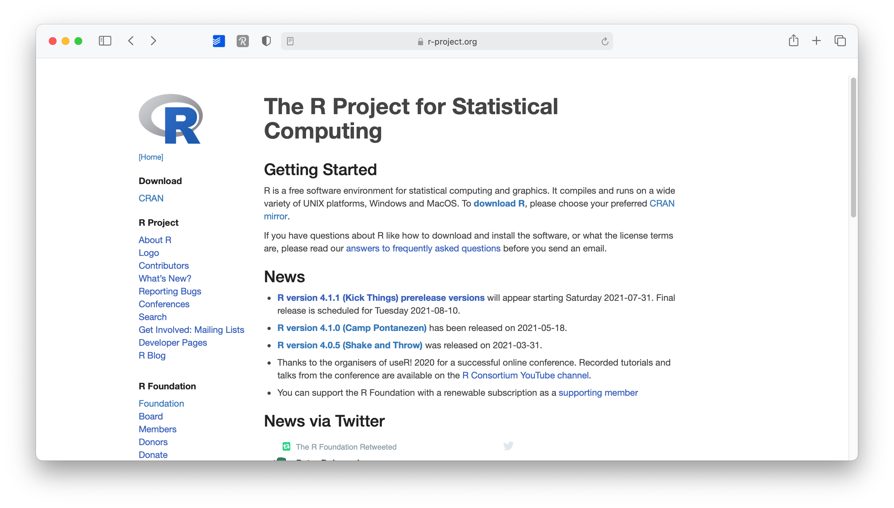

2. Click **CRAN** under *Download*.

3. Choose a mirror in your country — they all work, the close one is just faster.

   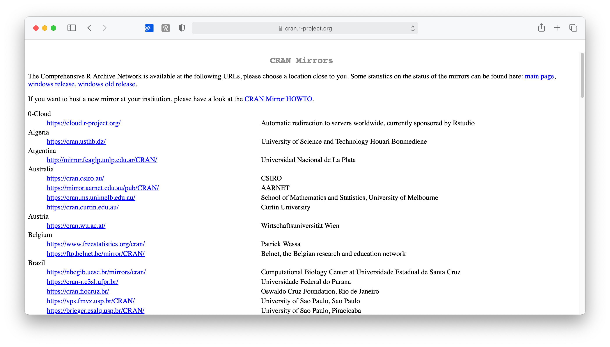

4. Select **Download R for macOS**.

   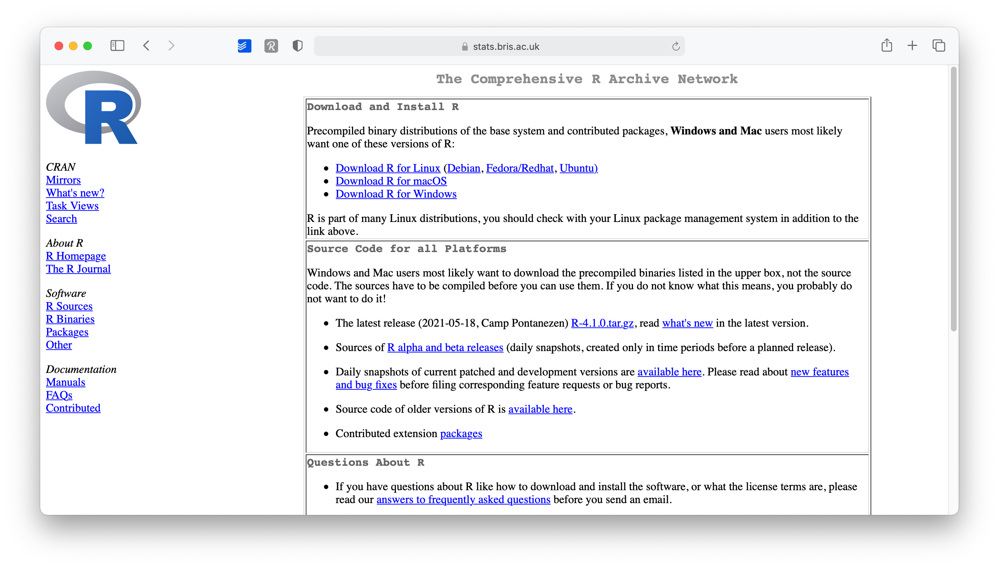

5. Pick the latest version. Check whether you need the **Apple silicon (arm64)** or the **Intel** build — Apple silicon is anything from the M1 on.

   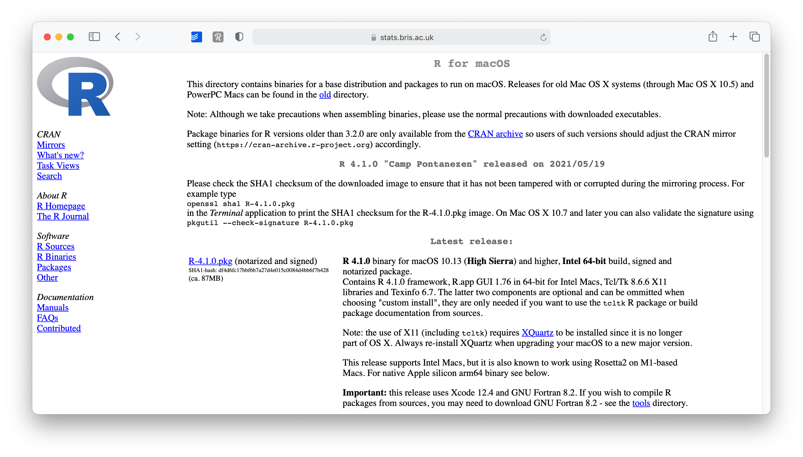

6. Open the downloaded `.pkg` and keep the suggested settings.

### Windows

1. Go to [r-project.org](https://www.r-project.org/) → **CRAN** → a mirror near you.
2. Click **Download R for Windows**, then **base**, then the download link at the top of the page.
3. Run the installer and step through the wizard. Defaults are fine.

You need administrator privileges on the machine. If you are on a locked-down work laptop, sort that out *before* the lab.

### Linux

R ships with many distributions, but usually at a version old enough to cause trouble. Follow **Download R for Linux** on CRAN and pick your distribution — Debian, Fedora/Redhat, SUSE and Ubuntu each have their own instructions, and on Linux building from source is the normal path rather than the exotic one.

:::

::: {.callout-note collapse="true"}
## Binaries versus source — what the installer is actually doing

On Windows and macOS you install R from a **precompiled binary**: someone else already ran the compiler, and the installer just puts the finished files in place. On Linux it is more common to **build from source**, which compiles R on your machine.

This matters exactly once: when a package needs compilation and you have no compiler. On macOS that is fixed by installing the Xcode command line tools (`xcode-select --install`), on Windows by installing [Rtools](https://cran.r-project.org/bin/windows/Rtools/). Do that only if a package install actually fails with a compilation error.
:::

## Install RStudio {#install-rstudio}

R by itself has no user interface worth the name. RStudio is an **IDE** — an integrated development environment — and it is where you will actually spend your time: editor, console, plots, files and environment in one window.

The company behind RStudio used to be called RStudio too; since 2023 it is **Posit**, because the product now covers Python as well. The IDE kept its name.

1. Go to [posit.co](https://posit.co/)

   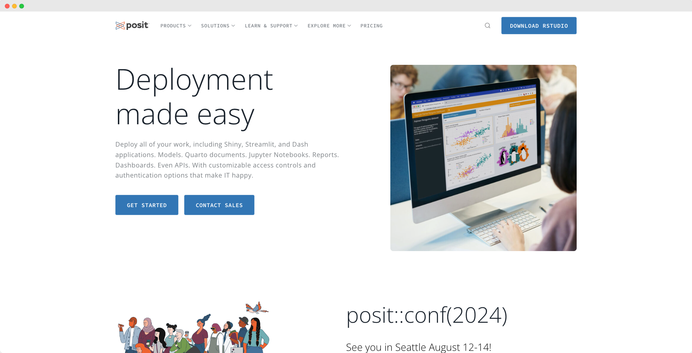

2. **Download RStudio** in the top right.

3. Choose **RStudio Desktop** — not RStudio Server.

   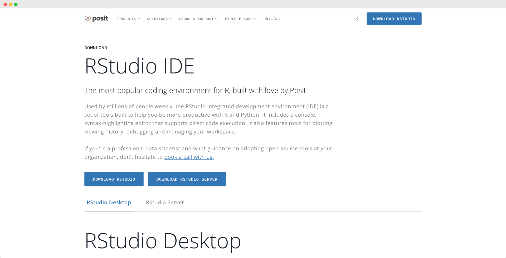

4. Scroll to the installer table and take the row for your OS. Different OS versions need different builds, so read the row rather than clicking the big button.

   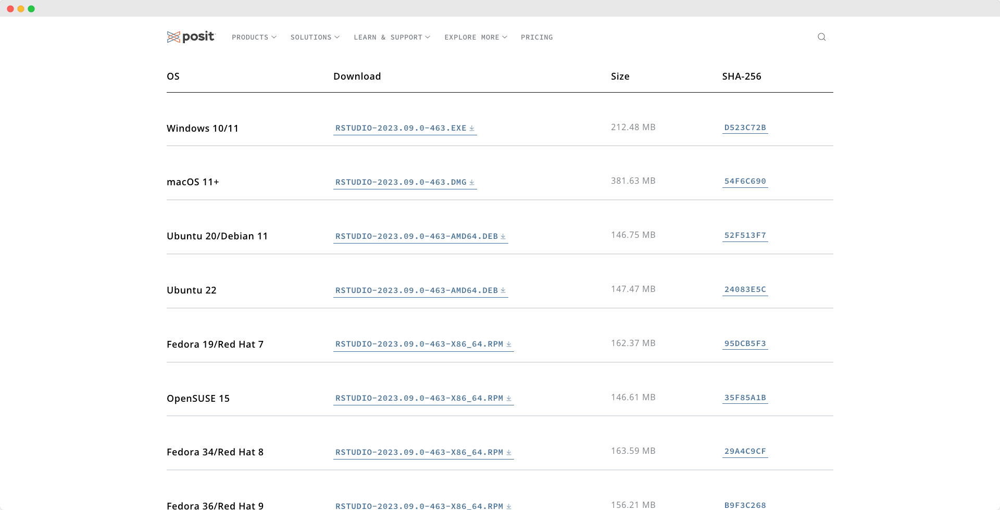

5. Install with the default settings.

From now on you only ever open **RStudio**. It starts R for you.

## Settings that matter {#settings-that-matter}

Open the preferences: `RStudio > Settings` (`⌘ ,`) on macOS, `Tools > Global Options` (`Ctrl ,`) on Windows.

Three changes, and the first one is the important one.

### 1. Stop restoring your last session

In `General > Basic`, untick everything starting with **Restore**:

- Restore most recently opened project at startup
- Restore previously open source documents at startup
- Restore `.RData` into workspace at startup

And set **Save workspace to .RData on exit** to **Never**.

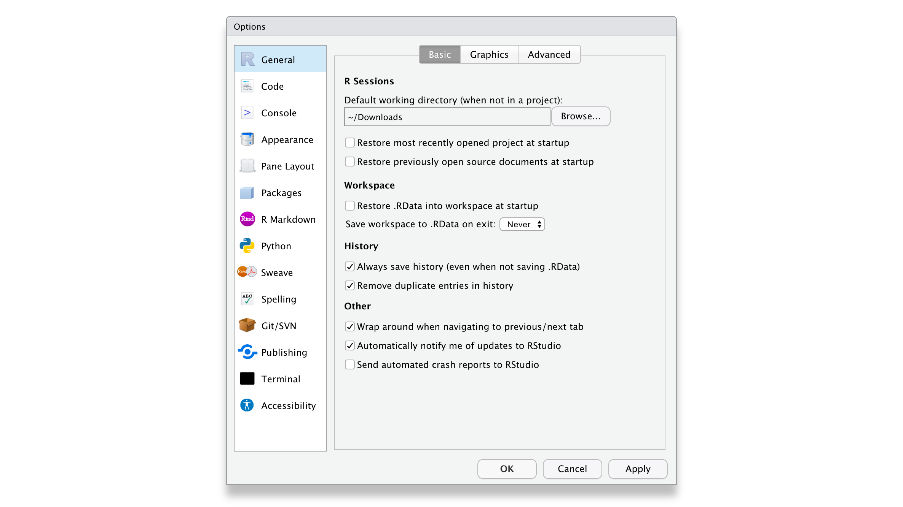

::: {.callout-important appearance="simple"}
This feels backwards — why throw away your work every time? Because a restored workspace makes your code *look* like it works when it does not. An object you created an hour ago and then deleted from the script is still sitting in memory; your script runs, and it will not run on anyone else's machine, including yours next week. Starting from a clean slate means the script is the only source of truth. This single setting removes most reproducibility bugs you would otherwise spend the semester chasing.
:::

### 2. Editing

In `Code > Editing`, tick at least the first five options — especially **Auto-indent code after paste**. Indentation is the cheapest readability you will ever get.

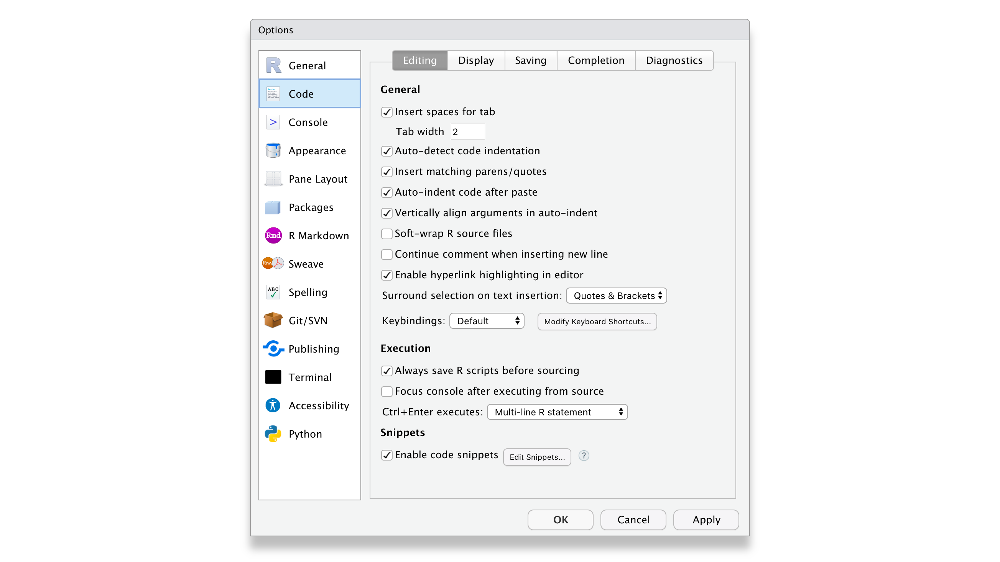

### 3. Display

In `Display`, tick the first three. **Highlight selected line** earns its keep as soon as your scripts get long.

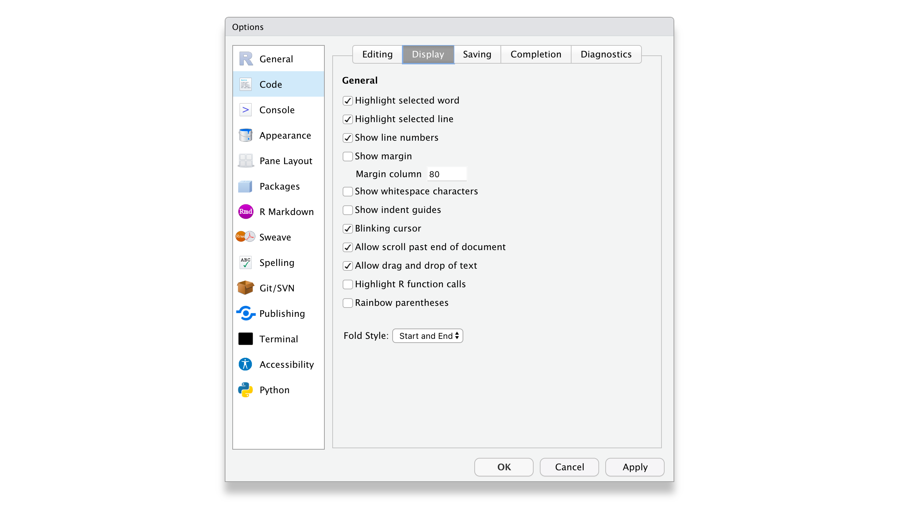

Then go to `Appearance` and pick a theme you like. No right answer here, and a dark theme does not make the models better.

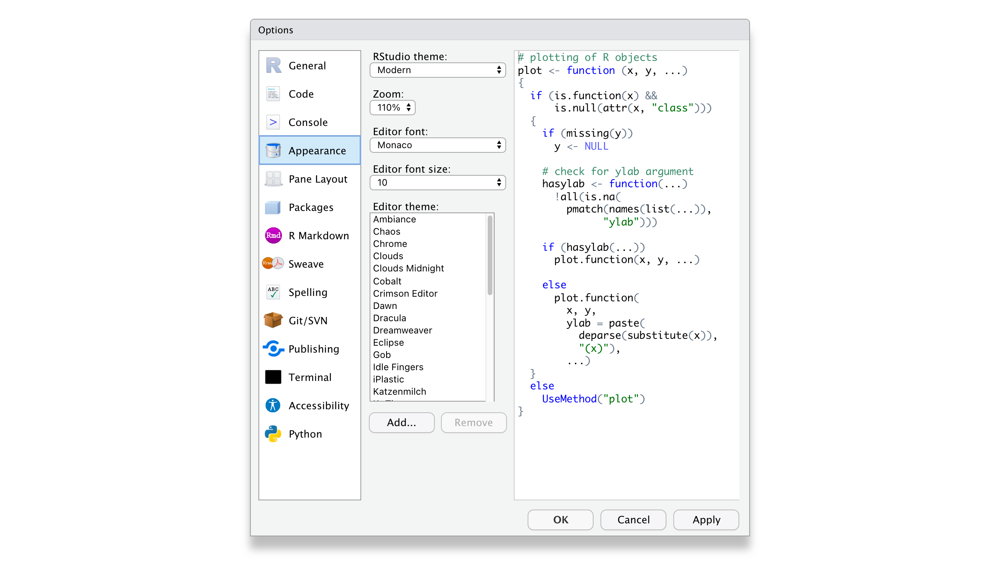

## R packages {#r-packages}

Most of what makes R useful is not loaded when R starts — it lives in **packages**. A package bundles functions, help files and datasets around one job. "Base R" is just the set of functions you get for free at startup.

Two steps, and people mix them up constantly:

```r
install.packages("dplyr")   # downloads it onto your computer — once, ever
library(dplyr)              # loads it into this session — every session
```

Installing puts the files on disk. Loading makes the functions callable *now*. Quotation marks are required for `install.packages()` and optional for `library()`.

Install several at once by passing a vector:

```r
install.packages(c("ggplot2", "dplyr", "glmnet"))
```

### Course packages {#course-packages}

Run this once. It takes a few minutes.

```r
install.packages(c(
  # data manipulation and graphics
  "tidyverse",     # dplyr, ggplot2, tidyr, readr and friends
  "here",          # sane file paths, see below
  "skimr",         # one-line data summaries

  # Module 1 — regression, regularisation, forecasting
  "glmnet",        # Ridge, LASSO, Elastic Net
  "survival",      # survival models
  "fable",         # tidy forecasting
  "feasts",        # time series features and decomposition
  "tsibble",       # time series as tidy data
  "forecast",      # ARIMA and classic forecasting

  # Module 2 — unsupervised learning and machine learning
  "factoextra",    # PCA and clustering visualisation
  "FactoMineR",    # PCA and correspondence analysis
  "cluster",       # k-means, hierarchical clustering, silhouettes
  "rpart",         # decision trees
  "rpart.plot",    # readable tree plots
  "ranger",        # random forests
  "xgboost",       # gradient boosting
  "nnet",          # neural networks
  "iml",           # interpretability: PDP, LIME, feature importance

  # datasets from the textbook
  "ISLR2"
))
```

Check it worked:

```r
library(tidyverse)
library(glmnet)
sessionInfo()
```

If `sessionInfo()` prints without an error, you are set.

### Updating

```r
update.packages(ask = FALSE)
```

R, RStudio and packages update **independently of each other**. Updating RStudio does not update R. This is the single most common source of "it worked yesterday": a package built for a newer R than the one you are running. Start a fresh session after updating anything.

::: {.callout-note collapse="true"}
## Installing from GitHub

Not everything is on CRAN. Development versions usually live on GitHub:

```r
install.packages("remotes")
remotes::install_github("user/repo")
```

Newer features, fewer guarantees. Fine for exploring, not what you want the night before an exam.
:::

## Start a project properly {#start-a-project-properly}

Do not work in loose scripts scattered across your Desktop. Make one **RStudio Project** for this course.

1. `File > New Project`

   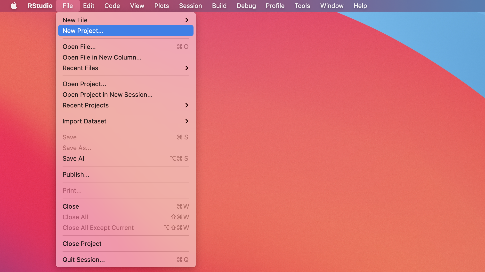

2. **New Directory**

   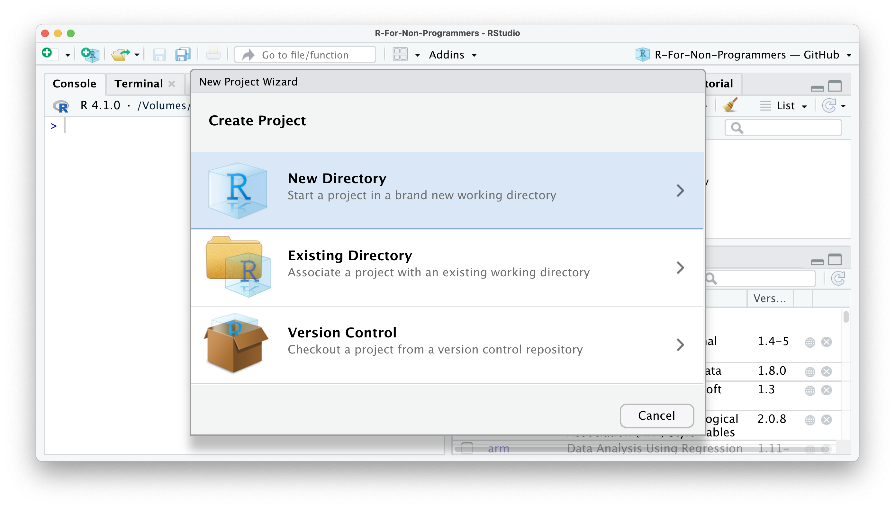

3. **New Project**

   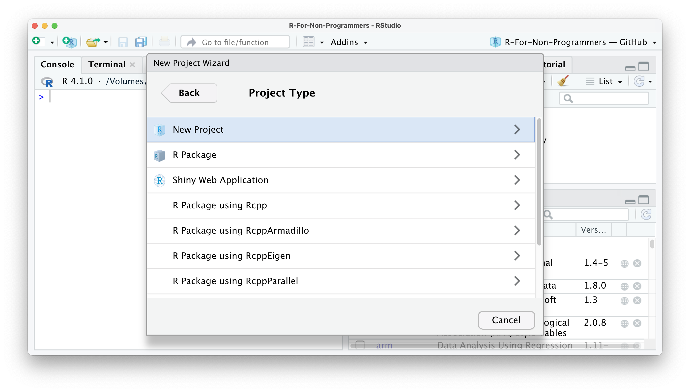

4. Name it — `sbd_26_27` works — and choose where it lives.

   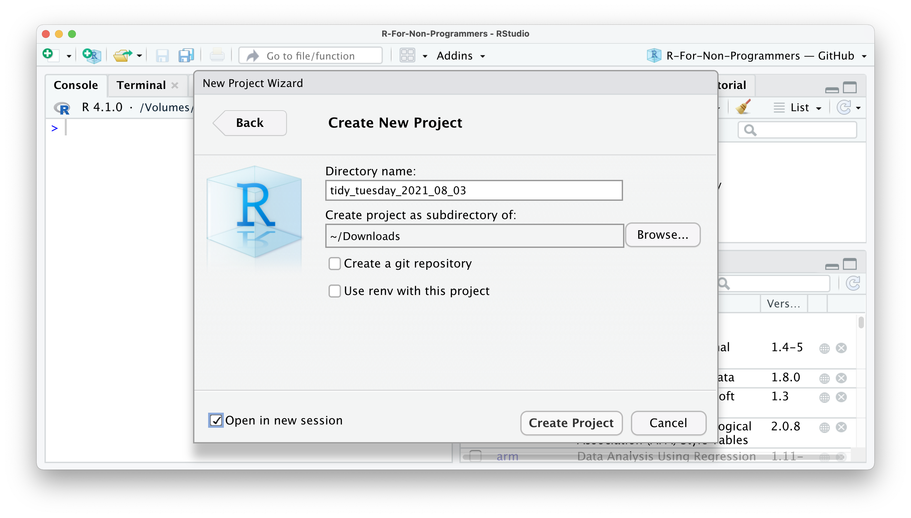

5. RStudio opens a fresh session with that folder as the working directory.

   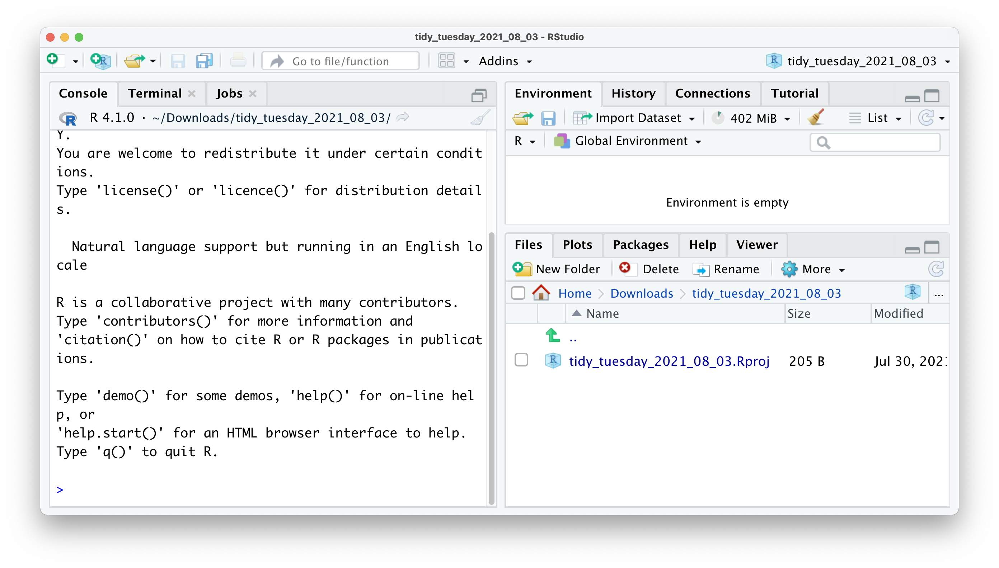

Inside it, make three folders: `data/`, `scripts/`, `output/`.

### Why the project matters: file paths

With a Project, you never write a path like `/Users/yourname/Desktop/stuff/data.csv` again. That path exists on exactly one computer on Earth. Use `here()` instead:

```r
library(here)
here()                            # the project root, whoever is running it
dat <- read_csv(here("data", "bikeshare.csv"))
```

`here()` finds the project root by looking for the `.Rproj` file, so the same line works on your laptop, on mine, and on the lab machines — which is where the exam happens.

## Python {#python}

A few labs use Python alongside R. If you have never installed Python, do not install it from python.org and do not fight your system Python.

::: {.panel-tabset}

### uv (recommended)

[uv](https://docs.astral.sh/uv/) installs Python and manages the environment, fast, without touching anything else on your machine.

```bash
# macOS / Linux
curl -LsSf https://astral.sh/uv/install.sh | sh

# Windows PowerShell
powershell -c "irm https://astral.sh/uv/install.ps1 | iex"
```

Then, inside your course folder:

```bash
uv init sbd-python
cd sbd-python
uv add pandas scikit-learn statsmodels pymc matplotlib seaborn jupyter
uv run jupyter lab
```

### Anaconda

If you prefer a click-through installer, get the [Anaconda Distribution](https://www.anaconda.com/download). It ships Python, the scientific stack and Jupyter in one go — several gigabytes, but nothing to configure.

Once installed, open Anaconda Navigator and launch JupyterLab.

:::

The packages we use:

| Package | What for |
|---|---|
| `pandas` | data frames |
| `scikit-learn` | trees, forests, boosting, clustering, PCA |
| `statsmodels` | regression and time series, closer to the R output you will recognise |
| `pymc` | Bayesian models |
| `matplotlib`, `seaborn` | plots |

::: {.callout-note appearance="simple"}
You are not expected to be fluent in both languages. The exam's coding part is in **R**. Python appears so you can see that the same method looks different in two ecosystems — useful the day a colleague hands you a `scikit-learn` pipeline.
:::

## When something breaks {#troubleshooting}

**`there is no package called 'x'`** — you loaded before installing. Run `install.packages("x")`.

**`could not find function "f"`** — the package is installed but not loaded in *this* session. Run `library(...)`.

**Install fails with compilation errors** — you need the build tools: `xcode-select --install` on macOS, [Rtools](https://cran.r-project.org/bin/windows/Rtools/) on Windows.

**`cannot open file 'data.csv'`** — a working directory problem. Open the Project, then use `here()`.

**It worked yesterday** — check `R.version.string` and whether you updated something. Restart R with `⌘⇧F10` / `Ctrl+Shift+F10` and run the script top to bottom in a clean session.

Still stuck? Bring the failing script and the exact error text to [office hours](office-hours.qmd) — a file beats a screenshot, and a screenshot beats a description.
